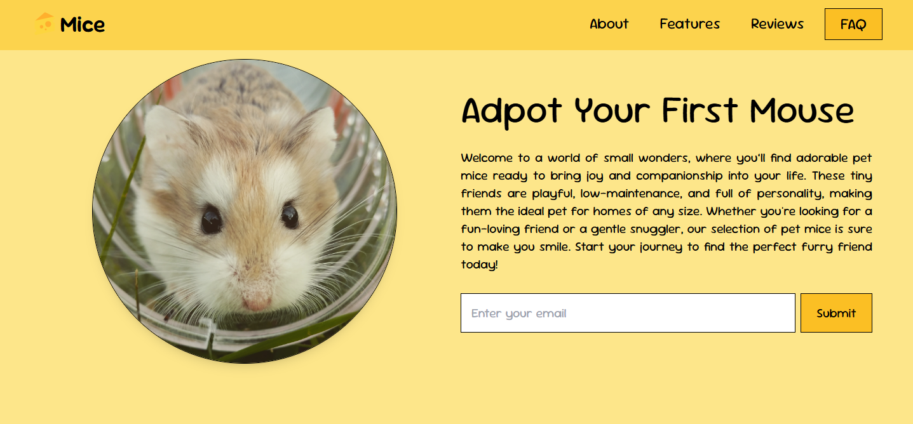

---

    

## Getting Started

Prerequisites
Make sure you have the following installed:

Node.js (version 14 or later)
Docker

## Installation
Clone the repository:

```bash
Copy code
git clone https://github.com/Kyle-Myre/Mice.git
cd Mice
```

### Install dependencies

```bash
Copy code
npm install
```

### Run the development server

```bash
npm run dev
```

```bash
npm run build
```

### To preview the production build:

```bash
npm run preview
```

## Usage

- Home Page: Explore a selection of pet mice.
- FAQ Section: Learn more about caring for your new pet.
- Email Subscription: Stay updated on new mice available for adoption.

## Contributing
Contributions are welcome! Please open an issue or submit a pull request for improvements or suggestions.

## License
This project is licensed under the GNU License. See the LICENSE file for details.

